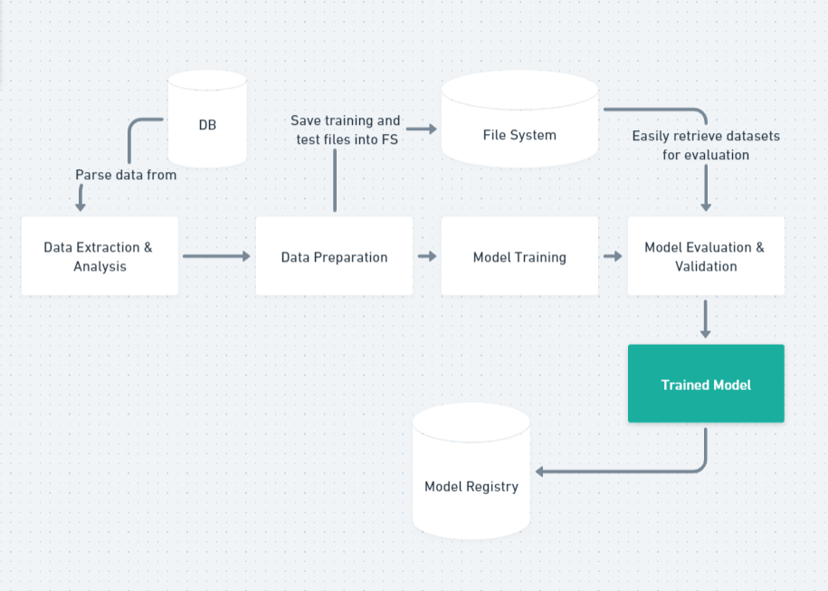

## Submission by

Name: Wong Shen Nan

Email: wongshennan@gmail.com

as part of the requirements for AIAP Batch 10

## Overview of submitted folder and file structure

-- data
|_ survive.db
-- models
-- src
|\* **pycache**
|_ cleanData.py
|_ categorizeData.py
|_ main.py (the entry point of the submission)
|_ parseData.py (reading data from db)
|_ splitTrainTest.py
|\_ trainModels.py
-- eda.ipynb
-- README.md
-- requirements.txt
-- run.sh
-- pipeline.png
-- submission.txt

## Instructions for executing the pipeline

On the command line, in the root folder, run
`./run.sh`

You can choose to run various models instead of running all at the same time. For help, run
`python3 src/main.py -h`
to see the available options.

## Pipeline

The pipeline is as follows:

1. Exploratory data analysis done on the data. DB is read and data is cleaned and analysed.
2. Data is then organised and categorised into discrete variables for easier classification.
3. Run and save various ML models.

## Broad Strategy

The aim is to identify factors that contribute greatly to the determination of the survival of patients. Understanding the key contributing factors can help doctors determine which trait ("features") to arrest in their prognosis.

Our data strategy is as follows:

1. Analyse data in general (understanding the dataset) - We will have a broad overview of the data provided and make intuitive assumptions about the potential causality of each feature.

2. It is likely that data imputation is required to top up any missing data and clean up any false representation. This will form the majority of our data organisation so that analysis can be undistracted.
   a. if the missing data is minimal in count, we shall inpute by commonality.
   b. if the missing data is substantial, or comprise a significant proportion of the feature, we shall inpute by randomising across a range between the established feature mean +- standard deviation of the distribution.

3. In order for a clean machine learning process, we will need to convert any continuous data into numerical categories. This allows proper labelling and clear categorisation. We should ensure that the data is segregated equally to prevent clear majority bias during training.

4. Once our data is cleaned and organised, we can then derive assumptions - e.g. some features are not really helpful

5. Group continuous data types into discrete categories e.g. age banding

6. Apply various ML models and assess their relative performance. Then we evaluate and optimize the hyperparameters.

## Key Findings

After a thorough data-exploration, we cleaned understood the relative feature importance of each feature. We also had a deeper understanding of the correlations between various datasets, as cross-examining various feature relationships gave us new insights into the dataset.

While pre-processing the data, we discretized continuous variables, imputed missing values and generated combined feature "BMI" that can more generically explain the relationship between obesity and survival rates.

Using various classification models, we found out that Random Forests provided us with great reliability and accuracy in predicting survival by assessing the importance of each feature and then optimizing the hyperparameters. Based on further evaluation, the computed prediction values of the Random Forests classifier indicates a 99.9% estimate of a patient's survival. Recall also indicates to us that the Random Forests algorithm can predict 100% of the people who will survive based on the set parameters. The F-score is a computation of the harmonic mean of the precision and recall variables we calculated above. The F-score classifier will return us a large number if and only if the recall and precision values are high. In this case, the Random Forests classifier returns us a near-perfect F-score.
